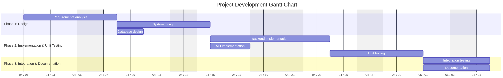

# Project Estimation

Date:

Version:

# Estimation approach

Consider the GeoControl project as described in the swagger, assume that you are going to develop the project INDEPENDENT of the deadlines of the course, and from scratch

# Estimate by size

###

|                                                                                                         | Estimate |
| ------------------------------------------------------------------------------------------------------- | -------- |
| NC = Estimated number of classes to be developed                                                        |15|
| A = Estimated average size per class, in LOC                                                            |200      |
| S = Estimated size of project, in LOC (= NC \* A)                                                       |3000          |
| E = Estimated effort, in person hours (here use productivity 10 LOC per person hour)                    |     300     |
| C = Estimated cost, in euro (here use 1 person hour cost = 30 euro)                                     |9000          |
| Estimated calendar time, in calendar weeks (Assume team of 4 people, 8 hours per day, 5 days per week ) |1.9 weeks          |

# Estimate by product decomposition

###

| component name       | Estimated effort (person hours) |
| -------------------- | ------------------------------- |
| requirement document |             35                    |
| design document      |             50                   |
| code                 |             120                   |
| unit tests           |             60                   |
| api tests            |             40                    |
| management documents |             30                    |
| **Total**            |            **335**                |

# Estimate by activity decomposition

###

| Activity name         | Estimated effort (person hours) |
|-----------------------|----------------------------------|
| Requirements analysis | 35                               |
| System design         | 50                               |
| Database design       | 20                               |
| Backend implementation| 80                               |
| API implementation    | 40                               |
| Unit testing          | 60                               |
| Integration testing   | 40                               |
| Documentation         | 30                               |
| **Total**             | **355**                          |

### Gantt

# Summary

Report here the results of the three estimation approaches. The estimates may differ. Discuss here the possible reasons for the difference

|                                    | Estimated effort | Estimated duration |
| ---------------------------------- | ---------------- | ------------------ |
| estimate by size                   |    300 person hours              | 1.9 weeks |
| estimate by product decomposition  |    335 person hours              | 2.1 weeks |
| estimate by activity decomposition |    355 person hours              | 2.2 weeks |

### Estimation Analysis

The three estimation approaches yield slightly different results, which is common in software project estimation. The differences can be attributed to:

1. **Different perspectives**: Size-based estimation focuses purely on code production, while product and activity decomposition consider additional aspects like documentation, testing, and management.

2. **Granularity**: Activity decomposition provides the most detailed breakdown, accounting for specific tasks like database design and integration testing that might be overlooked in simpler models.

3. **Overhead consideration**: Activity-based estimation better accounts for coordination overhead and integration challenges, resulting in higher estimates.

4. **Testing emphasis**: Both product and activity decomposition allocate significant effort to testing (approximately 30% of total effort), reflecting the project's high reliability requirements (NFR2) and test coverage target (NFR1).

---

The activity-based estimate is likely the most realistic as it provides the most comprehensive view of the project's complexity. The **GeoControl** system requires careful implementation of authentication, user management, topology management, measurement collection, and statistical analysis components, all with high reliability and security requirements.

For planning purposes, I recommend using the activity-based estimate of **355 person hours** to ensure adequate time for all necessary development activities and to account for potential challenges in implementing the system's complex requirements.

