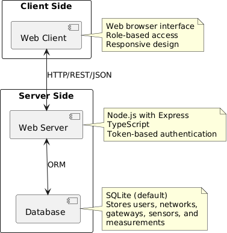

# Requirements Document - GeoControl

Date: 19/04/2025

Version: V1 - description of Geocontrol as described in the swagger

| Version number | Change |
| :------------: | :----: |
| 1              | Geocontrol as described in the swagger |

# Contents

- [Requirements Document - GeoControl](#requirements-document---geocontrol)
- [Contents](#contents)
- [Informal description](#informal-description)
- [Business model](#business-model)
- [Stakeholders](#stakeholders)
- [Context Diagram and interfaces](#context-diagram-and-interfaces)
  - [Context Diagram](#context-diagram)
  - [Interfaces](#interfaces)
- [Stories and personas](#stories-and-personas)
- [Functional and non functional requirements](#functional-and-non-functional-requirements)
  - [Functional Requirements](#functional-requirements)
  - [Non Functional Requirements](#non-functional-requirements)
- [Use case diagram and use cases](#use-case-diagram-and-use-cases)
  - [Use case diagram](#use-case-diagram)
- [Glossary](#glossary)
- [System Design](#system-design)
- [Rights Table](#rights-table)
- [Deployment Diagram](#deployment-diagram)

# Informal description

GeoControl is a software system designed for monitoring physical and environmental variables in various contexts: from hydrogeological analyses of mountain areas to the surveillance of historical buildings, and even the control of internal parameters (such as temperature or lighting) in residential or working environments.

# Business Model

The GeoControl system operates primarily on a B2B (Business-to-Business) and B2G (Business-to-Government) model.
## Key Partners
- Union of Mountain Communities
- Municipalities / Local Governments
- Research entities, universities
- Hardware Suppliers
- Legal Advisors
## Key Activities
- Continuous environmental and structural data monitoring
- Software and hardware maintenance and updates
- Secure user management and token-based authentication
- Statistical analysis and outlier detection
## Key Resources
- GeoControl software platform (backend, frontend, API, database)
- Network of physical devices (sensors, gateways)
- Development, maintenance, and support team
## Value Propositions
- Continuos Monitoring: Provides a robust software platform for continuous, high-reliability data collection from sensor networks.
- Actionable insights: Offers built-in statistical analysis and automated outlier detection to understand trends and identify potential issues.
- Controlled Access: Secure, token-based authentication with role-based permissions  ensures appropriate data access and system management capabilities.
## Customer Segments
- Local governments and public administrations
- Companies in environmental, agricultural, construction, and industrial sectors
- Engineering and architecture firms
- Cultural heritage preservation organizations
- Research entities, universities
## Channels
- Direct contact with municipalities, agencies, universities
- Online presence, through website and ads
## Customer Relationships
- Dedicated, direct technical support (email, helpdesk)
- Training for new users
- Regular updates and maintenance support
## Revenue Streams
- Customized services and implementations
- Public funding (regional/national projects, EU funds)
- Subscription-based access for private entities
## Cost Structure
- Software development and continuous improvements
- Staff costs (developers, support, legal)
- Acquisition and management of hardware components
- Promotional activities, ads
# Stakeholders

|Stakeholders|Description|
|---|---|
|The Union of Mountain Communities|Group of people that commissioned the GeoControl software for managing the hydrogeological state of the territory.|
|Public/private entities (End Users)|Companies and organizations interested in this software for various monitoring purposes, including environmental monitoring, structural integrity of buildings, and internal parameter control.|
|Administrator|Person who has full control and access to the system,responsible for user management and system configuration|
|Viewers (Data Analysts)|People who can only consult data, analyze measurements, and generate reports without modifying system configuration.|
|Operators (Deploy and Maintenance of gateways, networks and sensors)|People responsible for deploying and maintaining gateways,networks, and sensors, as well as inserting new measurements.|
|Developers|Group of people responsible for the design and structure of the software.|
|Maintenance staff for software|Group of people fixing bugs and providing updates to ensure system reliability and performance.|
|Hardware suppliers|Companies that provide physical components such as sensors, gateways, and networking equipment.|
|Legal Office|Department that manages contracts, data privacy concerns, and legal risks associated with the system.|
|Management office|Manages strategic planning, budgeting and coordination among different departments and stakeholders.|
|Marketing office|Promotes the project and manages communication with potential clients.|
|Network|The communication infrastructure that connects sensors and gateways|
|Gateway|A device that collects data from multiple sensors  and transmits it to the central system.|
|Sensor|A device that detects and measures.|

# Context Diagram and interfaces

## Context Diagram

## Interfaces

|  Actor   | Logical Interface |      Physical Interface      |
| :------: | :---------------: | :--------------------------: |
|  Admin   |   Web interface   |     Smartphone/Computer      |
|  Viewer  |   Web interface   |     Smartphone/Computer      |
| Operator |   Web interface   |     Smartphone/Computer      |
| Gateway  |        API        | Physical internet connection |

# Stories and personas

GeoControl is a software, commissioned by the Union of Mountain Communities, used to monitor the hydrological condition of Piedmont territories. It measures physical and environmental variables of several areas, from temperature and lighting to the structural characteristics of historical buildings of the territory. Despite that, it has been used even by private and public companies, thanks to its efficient and complex structure. GeoControl structure is composed of networks, managing different groups of devices, gateways, transmitting data from sensors to networks, and sensors, collecting data from the environment every 10 minutes. 

- ### The Administrator
	- works for the Union of Mountain Communities IT office.
	- Full control over the system.
	- Manages the users and is able to assign a new role to the users.
	- Create, update, and delete networks, gateways, and sensors

- ### The Operator
	- responsible for installing and maintaining sensors and gateways.
	- Register new gateways and sensors.
	- Update sensor configurations.
	- Ensure correct transmission and format of measurements.

- ### The Data Analyst (Viewer)
	- analyst at a private company using GeoControl to monitor environmental parameters in their industrial site.
	- Access measurement data.
	- Compute averages, variances, and detect outliers.
	- Export data and filter by time range or location.

# Functional and non functional requirements

## Functional Requirements

| REQUIREMENTS ID | DESCRIPTION                                                                                              |
| --------------- | -------------------------------------------------------------------------------------------------------- |
| FR1             | **Authentication and Authorization**                                                                     |
| FR1.1           | Login with username and password                                                                         |
| FR1.2           | Logout                                                                                                   |
| FR1.3           | Admin access: full access to all resources                                                               |
| FR1.4           | Operator access: manage sensors, gateways and networks and insert new measurements                       |
| FR1.5           | Viewer access: read-only data                                                                            |
| FR2             | User management                                                                                          |
| FR2.1           | Retrieve all users                                                                                       |
| FR2.2           | Create a new user                                                                                        |
| FR2.3           | Retrieve a specific user by username                                                                     |
| FR2.4           | Delete a user by username                                                                                |
| FR3             | **Topology Management and Synchronization**                                                              |
| FR3.1           | Retrieve all networks                                                                                    |
| FR3.2           | Create a new network                                                                                     |
| FR3.3           | Retrieve a specific network by networkCode                                                               |
| FR3.4           | Update a network with a specific networkCode                                                             |
| FR3.5           | Delete a network by networkCode                                                                          |
| FR3.6           | Retrieve all gateways from a network by networkCode                                                      |
| FR3.7           | Create a new gateway for a network with a specific networkCode                                           |
| FR3.8           | Retrieve a specific gateway by gatewayMac                                                                |
| FR3.9           | Update a gateway with a specific gatewayMac                                                              |
| FR3.10          | Delete a gateway with a specific gatewayMac                                                              |
| FR3.11          | Retrieve all sensors of a gateway identified by networkCode and gatewayMac                               |
| FR3.12          | Create a new sensor for a gateway identified by networkCode and gatewayMac                               |
| FR3.13          | Retrieve a specific sensor by sensorMac                                                                  |
| FR3.14          | Update a sensor identified by sensorMac                                                                  |
| FR3.15          | Delete a sensor identified by sensorMac                                                                  |
| FR4             | **Measurement Collection and Storage**                                                                   |
| FR4.1           | Retrieve measurements for a set of sensors of a specific network identified by networkCode               |
| FR4.2           | Retrieve only statistics for a set of sensors of a specific network identified by networkCode            |
| FR4.3           | Retrieve only outliers measurements for a set of sensors of a specific network identified by networkCode |
| FR4.4           | Store measurements for a sensor identified by sensorMac                                                  |
| FR4.5           | Retrieve measurements for a specific sensor identified by sensorMac                                      |
| FR4.6           | Retrieve statistics for a specific sensor identified by sensorMac                                        |
| FR4.7           | Retrieve only outliers measurements for a specific sensor identified by sensorMac                        |
| FR4.8           | Handle timezone conversion: store all timestamps in UTC format while accepting and displaying in ISO 8601 format with timezone |
| FR5             | **Calculations and Statistical Analysis**                                                                |
| FR5.1           | Compute mean of a given timestamp                                                                        |
| FR5.2           | Compute variance of a given timestamp                                                                    |
| FR5.3           | Compute upper Threshold                                                                                  |
| FR5.4           | Compute lower Threshold                                                                                  |
| FR5.5           | Identify outliers using thresholds                                                                       |

## Non Functional Requirements

| ID     | Type (efficiency, reliability, ..) | Description                                                                                                                                       | Refers to                                        |
| :----- | :--------------------------------- | :------------------------------------------------------------------------------------------------------------------------------------------------ | :----------------------------------------------- |
| NFR1.1 | Correctness                        | The code should have > 70% test coverage                                                                                                          | Developers, Data Analysts, Administrators        |
| NFR1.2 | Correctness                        | Statistical calculations (mean, variance, thresholds) must be accurate to at least 4 decimal places                                               | Data Analysts, Users, Developers             |
| NFR2.1 | Reliability                        | The system must ensure that no more than six measurements per year, per sensor, are lost, after being measured by the sensor                      | Operators, Developers, Maintenance Staff         |
| NFR2.2 | Reliability                        | The system must be available at least 99.5% of the time, monthly. Roughly equivalent of < 4h of downtime per month                                | Administrators, Users, Management Office     |
| NFR3.1 | Security                           | Every access to the system must be protected with user authentication. Roles are used to give permissions and authorize specific actions to users | Legal Office, Developers, Administrators         |
| NFR3.4 | Security                           | Passwords must be stored using strong hashing algorithms (e.g., bcrypt) with appropriate salt                                                     | Legal Office, Developers, Administrators         |
| NFR4.1 | Usability                          | A new viewer user should be able to create an account in less than 10 minutes                                                                     | Users, Viewers, Administrators               |
| NFR4.2 | Usability                          | A new viewer user should be able to login and retrieve the sensor statistics in a network in less than 5 minutes                                  | Users, Viewers, Administrators               |
| NFR4.3 | Usability                          | An administrator should be able to login and assign a role to a user in less than 5 minutes                                                       | Administrators, Management Office                |
| NFR4.4 | Usability                          | The system should provide human readable error messages that explain the issue, not only error codes                                              | Users, Operators, Administrators             |
| NFR4.5 | Compatibility            | The web interface must be fully functional on Firefox >= 135, Chrome >= 133, Safari >= 17 Chrome | Users, Developers |
| NFR5.1 | Efficiency                         | A sensor should be able to upload data to the system in less than 1s                                                                              | Data Analysts, Developers, Administrators        |
| NFR5.2 | Efficiency                         | The home page for the website should load in less than 4 seconds on a mid-range mobile phone from 2025, on a 4g network                           | Users, Viewers, Developers                   |
| NFR5.3 | Efficiency                         | Queries for statistical data should return results in under 3 seconds, even when processing up to 1000 measurement points                         | Data Analysts, Users, Developers             |
| NFR5.4 | Efficiency                         | The system should be able to handle at least 100 concurrent API requests without degradation in performance                                       | Operators, Users, Developers                 |
| NFR6.1 | Maintainability                    | The system should be upgradable in less than 1 hour. It should be deployable and runnable as a container                                          | Maintenance Staff, Developers, Management Office |
| NFR7.1 | Organizational                     | The system must be developed using TypeScript on the backend                                                                                      | Developers                                       |
| NFR7.2 | Organizational                     | The API must return JSON data                                                                                                                     | Developers                                       |
| NFR7.3 | Organizational                     | All timestamps must be stored in ISO 8601 format and converted as needed for display                                                              | Developers, Data Analysts                        |
| NFR7.4 | Organizational                     | The development process must include code reviews for all changes before merging into the main codebase                                           | Developers, Management Office                    |

# Use case diagram and use cases

## Use case diagram

## Use cases

## User management
### Use case 1.1, UC1.1 – Retrieve all users

|Actors Involved|Administrator|
| --- | --- |
|Precondition|The administrator is authenticated and possesses a valid token|
|Post condition|A list of users is returned, or an appropriate error is returned|
|Nominal Scenario|All registered users in the system are returned|
|Exceptions|Unauthorized access, insufficient rights, internal server error|

#### Scenario 1.1.1: List of users

|Scenario 1.1.1||
|---|---|
|Precondition|Administrator is authenticated with a valid token|
|Post condition|User management operation is completed successfully|
|Step#||
|1|Administrator sends GET request to /users|
|2|System validated administrator privileges|
|3|System returns list of all users with their details (excluding passwords) with 200 OK|

#### Scenario 1.1.2: Unauthorized

|Scenario 1.1.2||
|---|---|
|Precondition|Administrator is not authenticated with a valid token|
|Post condition|The request is rejected|
|Step#||
|1|Administrator sends GET request without a valid token|
|3|System returns 401 with message “Unauthorized: Invalid token format”|

#### Scenario 1.1.3: Insufficient rights

|Scenario 1.1.3||
|---|---|
|Precondition|User has a valid token but is not an admin|
|Post condition|The request is rejected|
|Step#||
|1|Non-admin user sends GET request to /users|
|2|System returns 403 with message: “Forbidden: Insufficient rights”|

|Scenario 1.1.4||
|---|---|
|Precondition|Server-side error occurs during login processing|
|Post condition|System fails and informs the user|
|Step#||
|1|System encounters unexpected error|
|2|System returns 500 with message: “Internal server error”|

### Use case 1.2, UC1.2 – Create a new user

|Actors Involved|Administrator|
|---|---|
|Precondition|Administrator is authenticated with valid token|
|Post condition|New user is created, or an appropriate error is returned|
|Nominal Scenario|User created|
|Exceptions|Unauthorized access, insufficient rights, username already in use, internal server error|

#### Scenario 1.2.1: User created

|Scenario 1.2.1||
|---|---|
|Precondition|Administrator is authenticated with valid token|
|Post condition|The user is created and stored in the system|
|Step#||
|1|Administrator sends POST request to /users with username, password, and type|
|2|System validates data and admin rights|
|3|System creates user and returns 201 Created|

#### Scenario 1.2.2: Invalid input data

|Scenario 1.2.2||
|---|---|
|Precondition|Input payload is missing required fields or improperly formatted|
|Post condition|User is not created|
|Step#||
|1|Administrator sends POST request with invalid data|
|2|System returns 400 with message: "BadRequest: missing required property"|

#### Scenario 1.2.3: Unauthorized

|Scenario 1.2.3||
|---|---|
|Precondition|Request sent without a valid token|
|Post condition|Request is rejected|
|Step#||
|1|Administrator sends POST without a valid token|
|2|System returns 401 with message: "Unauthorized: Invalid token format"|

#### Scenario 1.2.4: Insufficient rights

|Scenario 1.2.4||
|---|---|
|Precondition|Non-admin user attempts to create another user|
|Post condition|Request is denied|
|Step#||
|1|Operator or Viewer sends POST to /users|
|2|System returns HTTP 403 with message: "Forbidden: Insufficient rights"|

####  Scenario 1.2.5: Username already in use

|Scenario 1.2.5||
|---|---|
|Precondition|Username provided already exists|
|Post condition|User is not created|
|Step#||
|1|Administrator sends POST with existing username|
|2|System returns 409 with message: "Entity with code xxxxx already exists"|

####  Scenario 1.2.6: Internal server error

|Scenario 1.2.6||
|---|---|
|Precondition|Server-side error occurs during login processing|
|Post condition|System fails and informs the user|
|Step#||
|1|System encounters unexpected error|
|2|System returns 500 with message: “Internal server error”|

### Use case 1.3, UC1.3 – Retrieve a specific user

|Actors Involved|Administrator|
|---|---|
|Precondition|Administrator is authenticated with a valid token|
|Post condition|User data is returned if found, or an appropriate error is returned|
|Nominal Scenario|Specific user’s information is returned|
|Exceptions|Unauthorized, Insufficient rights, User not found, Internal server error|

#### Scenario 1.3.1: User Found

|Scenario 1.3.1||
|---|---|
|Precondition|Administrator is authenticated with a valid token and the specified user exists|
|Post condition|System returns user’s information|
|Step#||
|1|Administrator sends a GET request to /users/{userName} with a valid token|
|2|System verifies the token and admin privileges|
|3|System checks if the user exists|
|4|System returns user information with 200 OK|

#### Scenario 1.3.2: Unauthorized

|Scenario 1.3.2||
|---|---|
|Precondition|Administrator is not authenticated with a valid token|
|Post condition|The request is rejected|
|Step#||
|1|Administrator sends GET request without a valid token|
|2|System returns 401 with message “Unauthorized: Invalid token format”|

#### Scenario 1.3.3: Insufficient rights

|Scenario 1.3.3||
|---|---|
|Precondition|Non-admin user attempts to create another user|
|Post condition|Request is denied|
|Step#||
|1|Operator or Viewer sends POST to /users|
|2|System returns 403 with message: "Forbidden: Insufficient rights"|

#### Scenario 1.3.4: User not found

|Scenario 1.3.4||
|---|---|
|Precondition|The specified username does not exist in the system|
|Post condition|No information is returned|
|Step#||
|1| Administrator sends a GET request with a non-existent userName |
|2| System returns HTTP 404 with message: "Entity not found" |

#### Scenario 1.3.5: Internal server error

|Scenario 1.3.5||
|---|---|
|Precondition|Server-side error occurs during login processing|
|Post condition|System fails and informs the user|
|Step#||
|1|System encounters unexpected error|
|2|System returns 500 with message: “Internal server error”|

### Use case 1.4, UC1.4 – Delete a user

|Actors Involved|Administrator|
|---|---|
|Precondition|Administrator is authenticated with a valid token|
|Post condition|The specified user is successfully deleted from the system, or an appropriate error is returned|
|Nominal Scenario|User is deleted|
|Exceptions|Unauthorized, Insufficient rights, User not found, Internal server error|

#### Scenario 1.4.1: User deleted

|Scenario 1.4.1||
|---|---|
|Precondition|Administrator is authenticated with a valid token and the specified username exists|
|Post condition|User is deleted|
|Step#||
|1|Administrator sends a DELETE request to /users/{userName} with a valid token|
|2|System verifies the token and admin privileges|
|3|System checks if the user exists|
|4|System deletes the user and returns 204 No Content|

#### Scenario 1.4.2: Unauthorized

|Scenario 1.4.2||
|---|---|
|Precondition|Administrator is not authenticated with a valid token|
|Post condition|The request is rejected|
|Step#||
|1|Administrator sends GET request without a valid token|
|3|System returns 401 with message “Unauthorized: Invalid token format”|

#### Scenario 1.4.3: Insufficient rights

|Scenario 1.4.3||
|---|---|
|Precondition|User has a valid token but is not an admin|
|Post condition|The request is rejected|
|Step#||
|1|Non-admin user sends GET request to /users|
|2|System returns 403 with message: “Forbidden: Insufficient rights”|

#### Scenario 1.4.4: User not found

|Scenario 1.4.4||
|---|---|
|Precondition|The specified username does not exist in the system|
|Post condition|No information is returned|
|Step#||
|1| Administrator sends a GET request with a non-existent userName |
|2| System returns 404 with message: "Entity not found" |

#### Scenario 1.4.5: Internal server error

|Scenario 1.4.5||
|---|---|
|Precondition|Server-side error occurs during login processing|
|Post condition|System fails and informs the user|
|Step#||
|1|System encounters unexpected error|
|2|System returns 500 with message: “Internal server error”|

### Network management
#### Use case 2.1, Create Network 

| Actors Involved  | Admin, Operator                                             |
| ---------------- | ------------------------------------------------------------------- |
| Precondition     | User is authenticated and has role Admin or Operator |
| Post condition   | A new network is created and stored in the system                   |
| Nominal Scenario | An Admin or Operator creates a new network with a unique code, name, and description |
| Variants         |                          |
| Exceptions       | - Network code already exists (409 Conflict) - Invalid input data (400 Bad Request) - User has insufficient rights (403 Forbidden) |

##### Scenario 2.1.1: Successfully creating a new network

| Scenario 2.1.1   | Successfully creating a new network                                |
| ---------------- | ----------------------------------------------------------------- |
| Precondition     | User is authenticated, there isn't a network with the specified networkCode                      |
| Post condition   | A new network is added to the system                              |
| Step#            | Description                                                       |
| 1                | User provides network details (code, name, description)           |
| 2                | System validates that the network code is unique                  |
| 3                | System creates the new network                                    |
| 4                | System returns confirmation (201 Created)                         |

##### Scenario 2.1.2: Attempt to create a network with duplicate code

| Scenario 2.1.2   | Attempt to create a network with duplicate code                   |
| ---------------- | ----------------------------------------------------------------- |
| Precondition     | User is authenticated, there's already a network in the db with the same networkCode             |
| Post condition   | No network is created, error message is displayed                 |
| Step#            | Description                                                       |
| 1                | User provides network details with a code that already exists     |
| 2                | System detects the duplicate network code                         |
| 3                | System returns error (409 Conflict)                               |

#### Use case 2.2, Retrieve Networks

| Actors Involved  | Administrator, Operator, Viewer                                    |
| ---------------- | ------------------------------------------------------------------ |
| Precondition     | User is authenticated                            |
| Post condition   | List of networks or details of a specific network is returned      |
| Nominal Scenario | User retrieves all networks or details of a specific network       |
| Variants         | - Retrieve all networks - Retrieve a specific network by code   |
| Exceptions       | - Network not found (404 Not Found) - Authentication failed (401 Unauthorized) |

##### Scenario 2.2.1: Successfully retrieving all networks

| Scenario 2.2.1   | Successfully retrieving all networks                               |
| ---------------- | ------------------------------------------------------------------ |
| Precondition     | User is authenticated                                              |
| Post condition   | List of all networks is displayed                                  |
| Step#            | Description                                                        |
| 1                | User requests to view all networks                                 |
| 2                | System retrieves and returns list of all networks, status 200                 |

##### Scenario 2.2.2: Successfully retrieving a specific network

| Scenario 2.2.2   | Successfully retrieving a specific network                         |
| ---------------- | ------------------------------------------------------------------ |
| Precondition     | User is authenticated                                              |
| Post condition   | Details of the requested network are displayed                     |
| Step#            | Description                                                        |
| 1                | User provides a network code to retrieve                           |
| 2                | System finds the network with the given code                       |
| 3                | System returns the network details, status 200                              |

#### Use case 2.3, Update Network

| Actors Involved  | Admin, Operator                                             |
| ---------------- | ------------------------------------------------------------------- |
| Precondition     | User is authenticated with role Admin or Operator, network exists |
| Post condition   | Network information is updated                                      |
| Nominal Scenario | Admin or Operator updates network information (code, name, description) |
| Variants         | Any network field can be updated, including the network code        |
| Exceptions       | - Network not found (404 Not Found) - Invalid input data (400 Bad Request) - New network code conflicts with existing one (409 Conflict) - Insufficient rights (403 Forbidden) |

##### Scenario 2.3.1: Successfully updating network information

| Scenario 2.3.1   | Successfully updating network information                          |
| ---------------- | ------------------------------------------------------------------ |
| Precondition     | User is authenticated as Admin or Operator, network exists         |
| Post condition   | Network information is updated                                     |
| Step#            | Description                                                        |
| 1                | User provides updated network information                          |
| 2                | System validates the input data                                    |
| 3                | System updates the network information                             |
| 4                | System confirms successful update (204 No Content)                 |

#### Use case 2.4, Delete Network

| Actors Involved  | Administrator, Operator                                             |
| ---------------- | ------------------------------------------------------------------- |
| Precondition     | Actor is authenticated with appropriate permissions, network exists |
| Post condition   | Network is removed from the system                                  |
| Nominal Scenario | Admin or Operator deletes an existing network                       |
| Variants         | None                                                                |
| Exceptions       | - Network not found (404 Not Found) - Insufficient rights (403 Forbidden) |

##### Scenario 2.4.1: Successfully deleting a network

| Scenario 2.4.1   | Successfully deleting a network                                    |
| ---------------- | ------------------------------------------------------------------ |
| Precondition     | User is authenticated as Admin or Operator, network exists         |
| Post condition   | Network is removed from the system                                 |
| Step#            | Description                                                        |
| 1                | User selects a network to delete                                   |
| 2                | System confirms the network exists                                 |
| 3                | System deletes the network and all associated data                 |
| 4                | System confirms successful deletion (204 No Content)               |

### Sensor management
#### Use case 3.1, Create Sensor

| Actors Involved  | Admin, Operator                                             |
| ---------------- | ------------------------------------------------------------------- |
| Precondition     | User is authenticated with role Admin or Operator, specified network and gateway exist |
| Post condition   | A new sensor is created and linked to the specified gateway           |
| Nominal Scenario | Admin or Operator creates a new sensor with a unique MAC address, name, and other properties |
| Variants         |                                                                     |
| Exceptions       | - Sensor MAC address already exists (409 Conflict) - Invalid input data (400 Bad Request) - Network/Gateway not found (404 Not Found) - User has insufficient rights (403 Forbidden) |

##### Scenario 3.1.1: Successfully creating a new sensor

| Scenario 3.1.1   | Successfully creating a new sensor                              |
| ---------------- | ----------------------------------------------------------------- |
| Precondition     | User is authenticated as Admin or Operator, network and gateway exist |
| Post condition   | A new sensor is added to the specified gateway                     |
| Step#            | Description                                                       |
| 1                | User provides sensor details (MAC address, name, description, etc.) |
| 2                | System creates the new sensor and links it to the gateway         |
| 3                | System returns confirmation (201 Created)                         |

#### Use case 3.2, Retrieve Sensors

| Actors Involved  | Administrator, Operator, Viewer                                    |
| ---------------- | ------------------------------------------------------------------ |
| Precondition     | User is authenticated                                              |
| Post condition   | List of sensors or details of a specific sensor is returned        |
| Nominal Scenario | User retrieves all sensors for a gateway or details of a specific sensor |
| Variants         | - Retrieve all sensors for a gateway - Retrieve a specific sensor by MAC address |
| Exceptions       | - Network/Gateway/Sensor not found (404 Not Found) - Authentication failed (401 Unauthorized) |

##### Scenario 3.2.1: Successfully retrieving all sensors for a gateway

| Scenario 3.2.1   | Successfully retrieving all sensors for a gateway                |
| ---------------- | ------------------------------------------------------------------ |
| Precondition     | User is authenticated, network and gateway exist                  |
| Post condition   | List of all sensors for the gateway is displayed                  |
| Step#            | Description                                                        |
| 1                | User requests to view all sensors for a specific gateway           |
| 2                | System retrieves the list of all sensors for the gateway               |
| 3                | System returns the retrieved list, status 200 |

##### Scenario 3.2.2: Successfully retrieving a specific sensor

| Scenario 3.2.2   | Successfully retrieving a specific sensor                         |
| ---------------- | ------------------------------------------------------------------ |
| Precondition     | User is authenticated, sensor exists                              |
| Post condition   | Details of the requested sensor are displayed                     |
| Step#            | Description                                                        |
| 1                | User provides a sensor MAC address to retrieve                     |
| 2                | System retrieves sensor details       |
| 3                | System returns the data retrieved, status 200                      |

#### Use case 3.3, Update Sensor

| Actors Involved  | Admin, Operator                                             |
| ---------------- | ------------------------------------------------------------------- |
| Precondition     | User is authenticated with role Admin or Operator, sensor exists |
| Post condition   | Sensor information is updated                                      |
| Nominal Scenario | Admin or Operator updates sensor information (MAC address, name, description) |
| Variants         | Any sensor field can be updated, including the sensor MAC address    |
| Exceptions       | - Sensor not found (404 Not Found) - Invalid input data (400 Bad Request) - New sensor MAC address conflicts with existing one (409 Conflict) - Insufficient rights (403 Forbidden) |

##### Scenario 3.3.1: Successfully updating sensor information

| Scenario 3.3.1   | Successfully updating sensor information                          |
| ---------------- | ------------------------------------------------------------------ |
| Precondition     | User is authenticated as Admin or Operator, sensor exists          |
| Post condition   | Sensor information is updated                                      |
| Step#            | Description                                                        |
| 1                | User provides updated sensor information                           |
| 2                | System validates the input data                                    |
| 3                | System updates the sensor information                              |
| 4                | System confirms successful update (204 No Content)                 |

#### Use case 3.4, Delete Sensor

| Actors Involved  | Administrator, Operator                                             |
| ---------------- | ------------------------------------------------------------------- |
| Precondition     | Actor is authenticated with appropriate permissions, sensor exists  |
| Post condition   | Sensor is removed from the system                                   |
| Nominal Scenario | Admin or Operator deletes an existing sensor                        |
| Variants         | None                                                                |
| Exceptions       | - Sensor not found (404 Not Found) - Insufficient rights (403 Forbidden) |

##### Scenario 3.4.1: Successfully deleting a sensor

| Scenario 3.4.1   | Successfully deleting a sensor                                    |
| ---------------- | ------------------------------------------------------------------ |
| Precondition     | User is authenticated as Admin or Operator, sensor exists          |
| Post condition   | Sensor is removed from the system                                  |
| Step#            | Description                                                        |
| 1                | User selects a sensor to delete                                    |
| 2                | System deletes the sensor and all associated data (measurements)   |
| 3                | System confirms successful deletion (204 No Content)               |

### USE CASES 4 – Gateways Management

#### Use case 4.1, Retrieve all gateways of a network

|Actors Involved|Administrator, Operator|
|---|---|
|Precondition|User is authenticated with appropriate privileges|
|Post condition|Gateway topology is successfully managed|
|Nominal Scenario|User retrieves all gateways of a network|
|Variants|Gateway management, retrieve a specific gateway|
|Exceptions|Unauthorized, Network not found, Internal server error|

##### Scenario 4.1.1: A list of gateways

|Scenario 4.1.1|A list of gateways|
|---|---|
|Precondition|User has Administrator or Operator role, and network exists|
|Post condition|The list of gateways is provided|
|Step#|Description|
|1|User sends request including network code|
|2|System validates input data and network existence|
|3|System retrieves the list of all gateways, status 200|

##### Scenario 4.1.2: Unauthorized access

|Scenario 4.1.2|Unauthorized access|
|---|---|
|Precondition|User hasn’t Administrator or Operator role|
|Post condition|Error returned|
|Step#|Description|
|1|User sends request including network code|
|2|System checks user’s role|
|3|System returns error 401|

##### Scenario 4.1.3: Network not found

|Scenario 4.1.3|Network not found|
|---|---|
|Precondition|User has Administrator or Operator role|
|Post condition|Error returned|
|Step#|Description|
|1|User sends request including network code|
|2|System checks network existence|
|3|System returns error 404|

##### Scenario 4.1.4: Internal server error

|Scenario 4.1.4|Internal server error|
|---|---|
|Precondition|Server-side error occurs during user’s request|
|Post condition|System fails to process the request and inform the user of an internal issue|
|Step#|Description|
|1|System encounters an unexpected error while processing the request|
|2|System returns 500 Internal Server Error|

##### Scenario 4.1.5: Retrieve a specific gateway of a network

|Scenario 4.1.5|Retrieve a specific gateway of a network|
|---|---|
|Precondition|User has Admin or Operator role, network exists, and gateway exists.|
|Post condition|Gateway is retrieved|
|Step#|Description|
|1|User sends a request with a specific network code and gateway mac address.|
|2|System validates network existence and gateway existence.|
|3|System retrieves the gateway and returns 200.|

#### Use case 4.2, Create a new gateway for a network

|Actors Involved|Administrator, Operator|
|---|---|
|Precondition|User is authenticated with appropriate privileges|
|Post condition|Gateway is successfully created|
|Nominal Scenario|User creates a new gateway for the network|
|Variants|Gateway management|
|Exceptions|Invalid input data, Unauthorized, Insufficient rights, Network not found, Gateway mac address already in use, Internal server error|

##### Scenario 4.2.1: Gateway created

|Scenario 4.2.1|Gateway created|
|---|---|
|Precondition|User has Administrator or Operator role, and network exists|
|Post condition|Gateway is created|
|Step#|Description|
|1|User sends request including network code and request body|
|2|System validates input data and network existence|
|3|System creates a new gateway, it returns 201.|

##### Scenario 4.2.2: Unauthorized access

|Scenario 4.2.2|Unauthorized access|
|---|---|
|Precondition|User hasn’t Administrator or Operator role|
|Post condition|Error returned|
|Step#|Description|
|1|User sends request including network code|
|2|System checks user’s role|
|3|System returns error 401|

##### Scenario 4.2.3: Insufficient rights

|Scenario 4.2.3|Insufficient rights|
|---|---|
|Precondition|User hasn’t the rights to create a new gateway|
|Post condition|Error returned|
|Step#|Description|
|1|User sends request including network code|
|2|System checks user’s rights|
|3|System returns error 403|

##### Scenario 4.2.4: Network not found

|Scenario 4.2.4|Network not found|
|---|---|
|Precondition|User has Administrator or Operator role|
|Post condition|Error returned|
|Step#|Description|
|1|User sends request including network code|
|2|System checks network existence|
|3|System returns error 404|

##### Scenario 4.2.5: Gateway Mac address already in use

|Scenario 4.2.5|Gateway Mac address already in use|
|---|---|
|Precondition|User has Administrator or Operator role|
|Post condition|Error returned|
|Step#|Description|
|1|User sends request including network code|
|2|System checks if the network code already exists.|
|3|System returns error 409|

##### Scenario 4.2.6: Internal server error

|Scenario 4.2.6|Internal server error|
|---|---|
|Precondition|Server-side error occurs during user’s request|
|Post condition|System fails to process the request and inform the user of an internal issue|
|Step#|Description|
|1|System encounters an unexpected error while processing the request|
|2|System returns 500 Internal Server Error|

#### Use case 4.3, Update a gateway

|Actors Involved|Administrator, Operator|
|---|---|
|Precondition|User is authenticated with appropriate privileges|
|Post condition|Gateway is successfully updated|
|Nominal Scenario|User updates a gateway for the network|
|Variants|Gateway management|
|Exceptions|Invalid input data, Unauthorized, Insufficient rights, Network/Gateway not found, Gateway mac address already in use, Internal server error|

##### Scenario 4.3.1: Gateway updated

|Scenario 4.3.1|Gateway updated|
|---|---|
|Precondition|User has Administrator or Operator role, and network exists|
|Post condition|Gateway is updated|
|Step#|Description|
|1|User sends request including network code and request body|
|2|System validates input data and network existence|
|3|System updates the gateway, it returns 204.|

##### Scenario 4.3.2: Unauthorized access

|Scenario 4.3.2|Unauthorized access|
|---|---|
|Precondition|User hasn’t Administrator or Operator role|
|Post condition|Error returned|
|Step#|Description|
|1|User sends request including network code|
|2|System checks user’s role|
|3|System returns error 401|

##### Scenario 4.3.3: Insufficient rights

|Scenario 4.3.3|Insufficient rights|
|---|---|
|Precondition|User hasn’t the rights to update a gateway|
|Post condition|Error returned|
|Step#|Description|
|1|User sends request including network code|
|2|System checks user’s rights|
|3|System returns error 403|

##### Scenario 4.3.4: Network/Gateway not found

|Scenario 4.3.4|Network/Gateway not found|
|---|---|
|Precondition|User has Administrator or Operator role|
|Post condition|Error returned|
|Step#|Description|
|1|User sends request including network code and gateway mac address|
|2|System checks network existence and gateway existence|
|3|System returns error 404|

##### Scenario 4.3.5: Gateway Mac address already in use

|Scenario 4.3.5|Gateway Mac address already in use|
|---|---|
|Precondition|User has Administrator or Operator role|
|Post condition|Error returned|
|Step#|Description|
|1|User sends request including network code and updated gateway mac address|
|2|System checks if the new gateway mac address already exists.|
|3|System returns error 409|

##### Scenario 4.3.6: Internal server error

|Scenario 4.3.6|Internal server error|
|---|---|
|Precondition|Server-side error occurs during user’s request|
|Post condition|System fails to process the request and inform the user of an internal issue|
|Step#|Description|
|1|System encounters an unexpected error while processing the request|
|2|System returns 500 Internal Server Error|

#### Use case 4.4, Delete a gateway

|Actors Involved|Administrator, Operator|
|---|---|
|Precondition|User is authenticated with appropriate privileges|
|Post condition|Gateway is successfully deleted|
|Nominal Scenario|User deletes a gateway for the network|
|Variants|Gateway management|
|Exceptions|Unauthorized, Insufficient rights, Network/Gateway not found, Internal server error|

##### Scenario 4.4.1: Gateway deleted

|Scenario 4.4.1|Gateway deleted|
|---|---|
|Precondition|User has Administrator or Operator role, and network/gateway exists|
|Post condition|Gateway is deleted|
|Step#|Description|
|1|User sends request including network code and gateway mac address|
|2|System validates input data and network/gateway existence|
|3|System deletes the gateway, it returns 204.|

##### Scenario 4.4.2: Unauthorized access

|Scenario 4.4.2|Unauthorized access|
|---|---|
|Precondition|User hasn’t Administrator or Operator role|
|Post condition|Error returned|
|Step#|Description|
|1|User sends request including network code|
|2|System checks user’s role|
|3|System returns error 401|

##### Scenario 4.4.3: Insufficient rights

|Scenario 4.4.3|Insufficient rights|
|---|---|
|Precondition|User hasn’t the rights to delete a gateway|
|Post condition|Error returned|
|Step#|Description|
|1|User sends request including network code|
|2|System checks user’s rights|
|3|System returns error 403|

##### Scenario 4.4.4: Network/Gateway not found

|Scenario 4.4.4|Network/Gateway not found|
|---|---|
|Precondition|User has Administrator or Operator role|
|Post condition|Error returned|
|Step#|Description|
|1|User sends request including network code and gateway mac address|
|2|System checks network existence and gateway existence.|
|3|System returns error 404|

##### Scenario 4.4.5: Internal server error

|Scenario 4.4.5|Internal server error|
|---|---|
|Precondition|Server-side error occurs during user’s request|
|Post condition|System fails to process the request and inform the user of an internal issue|
|Step#|Description|
|1|System encounters an unexpected error while processing the request|
|2|System returns 500 Internal Server Error|

### USE CASES 5 – Measurements management

#### Use case 5.1 – Retrieve measurements

|Actors involved|Operator, Viewer|
|---|---|
|Precondition|User is authenticated with appropriate privileges|
|Postcondition|Measurements are successfully retrieved|
|Nominal scenario|User retrieves measurements|
|Variants|Retrieve measurements for a set of sensors or for a specific sensor|
|Exceptions|Unauthorized, Network not found, Internal server error|

##### SCENARIO 5.1.1 – Retrieve measurements for a set of sensors of a network

|Scenario 5.1.1|Retrieve measurements for a set of sensors of a network|
|---|---|
|Precondition|User is authenticated and network exists|
|Postcondition|Measurements are retrieved|
|Step #|Description|
|1|User sends request including network code, start date and end date|
|2|System validates input data and network existence|
|3|System retrieves measurements, it returns 200.|

##### SCENARIO 5.1.2 – Retrieve measurements for a sensor of a network

|Scenario 5.1.2|Retrieve measurements for a sensor of a network|
|---|---|
|Precondition|User is authenticated and network, gateway and sensor exist.|
|Postcondition|Measurements are retrieved|
|Step #|Description|
|1|User sends request including network code, gateway mac address, sensor mac address, start date and end date|
|2|System validates input data and network, gateway and sensor existence|
|3|System retrieves measurements, it returns 200.|

##### SCENARIO 5.1.3 – Unauthorized access

|Scenario 5.1.3|Unauthorized access|
|---|---|
|Precondition|Network exists|
|Postcondition|Error returned|
|Step #|Description|
|1|User sends request including network code|
|2|System checks user authentication|
|3|System returns error 401|

##### SCENARIO 5.1.4 – Network not found

|Scenario 5.1.4|Network not found|
|---|---|
|Precondition|User is authenticated|
|Postcondition|Error returned|
|Step #|Description|
|1|User sends request including network code|
|2|System checks network existence.|
|3|System returns error 404|

##### SCENARIO 5.1.5 – Internal server error

|Scenario 5.1.5|Internal server error|
|---|---|
|Precondition|Server-side error occurs during user’s request|
|Postcondition|System fails to process the request and inform the user of an internal issue|
|Step #|Description|
|1|System encounters an unexpected error while processing the request|
|2|System returns 500 Internal Server Error|

#### USE CASES 5.2 – Retrieve only statistics

|Actors involved|Operator, Viewer|
|---|---|
|Precondition|User is authenticated with appropriate privileges|
|Postcondition|Statistics are successfully retrieved|
|Nominal scenario|User retrieves statistics|
|Variants|Retrieve statistics for a set of sensors or for a specific sensor|
|Exceptions|Unauthorized, Network not found, Internal server error|

##### SCENARIO 5.2.1 – Retrieve only statistics for a set of sensors of a network

|Scenario 5.2.1|Retrieve measurements for a set of sensors of a network|
|---|---|
|Precondition|User is authenticated and network exists|
|Postcondition|Measurements are retrieved|
|Step #|Description|
|1|User sends request including network code, start date and end date|
|2|System validates input data and network existence|
|3|System retrieves measurements, it returns 200.|

##### SCENARIO 5.2.2 – Retrieve only statistics for a sensor of a network

|Scenario 5.2.2|Retrieve statistics for a sensor of a network|
|---|---|
|Precondition|User is authenticated and network, gateway and sensor exist.|
|Postcondition|Statistics are retrieved|
|Step #|Description|
|1|User sends request including network code, gateway mac address, sensor mac address, start date and end date|
|2|System validates input data and network, gateway and sensor existence|
|3|System retrieves statistics, it returns 200.|

##### SCENARIO 5.2.3 – Unauthorized access

|Scenario 5.2.3|Unauthorized access|
|---|---|
|Precondition|Network exists|
|Postcondition|Error returned|
|Step #|Description|
|1|User sends request including network code|
|2|System checks user authentication|
|3|System returns error 401|

##### SCENARIO 5.2.4 – Network not found

|Scenario 5.2.4|Network not found|
|---|---|
|Precondition|User is authenticated|
|Postcondition|Error returned|
|Step #|Description|
|1|User sends request including network code|
|2|System checks network existence.|
|3|System returns error 404|

##### SCENARIO 5.2.5 – Internal server error

|Scenario 5.2.5|Internal server error|
|---|---|
|Precondition|Server-side error occurs during user’s request|
|Postcondition|System fails to process the request and inform the user of an internal issue|
|Step #|Description|
|1|System encounters an unexpected error while processing the request|
|2|System returns 500 Internal Server Error|

#### USE CASES 5.3 – Retrieve only outliers

|Actors involved|Operator, Viewer|
|---|---|
|Precondition|User is authenticated with appropriate privileges|
|Postcondition|Outliers are successfully retrieved|
|Nominal scenario|User retrieves outliers|
|Variants|Retrieve outliers for a set of sensors or for a specific sensor|
|Exceptions|Unauthorized, Network not found, Internal server error|

##### SCENARIO 5.3.1 – Retrieve outliers measurements for a set of sensors of a network

|Scenario 5.3.1|Retrieve outliers for a set of sensors of a network|
|---|---|
|Precondition|User is authenticated and network exists|
|Postcondition|Outliers are retrieved|
|Step #|Description|
|1|User sends request including network code, start date and end date|
|2|System validates input data and network existence|
|3|System retrieves outliers, it returns 200.|

##### SCENARIO 5.3.2 – Retrieve outliers measurements for a sensor of a network

|Scenario 5.3.2|Retrieve outliers for a sensor of a network|
|---|---|
|Precondition|User is authenticated and network, gateway and sensor exist.|
|Postcondition|Outliers are retrieved|
|Step #|Description|
|1|User sends request including network code, gateway mac address, sensor mac address, start date and end date|
|2|System validates input data and network, gateway and sensor existence|
|3|System retrieves outliers, it returns 200.|

##### SCENARIO 5.3.3 – Unauthorized access

|Scenario 5.3.3|Unauthorized access|
|---|---|
|Precondition|Network exists|
|Postcondition|Error returned|
|Step #|Description|
|1|User sends request including network code|
|2|System checks user authentication|
|3|System returns error 401|

##### SCENARIO 5.3.4 – Network not found

|Scenario 5.3.4|Network not found|
|---|---|
|Precondition|User is authenticated|
|Postcondition|Error returned|
|Step #|Description|
|1|User sends request including network code|
|2|System checks network existence.|
|3|System returns error 404|

##### SCENARIO 5.3.5 – Internal server error

|Scenario 5.3.5|Internal server error|
|---|---|
|Precondition|Server-side error occurs during user’s request|
|Postcondition|System fails to process the request and inform the user of an internal issue|
|Step #|Description|
|1|System encounters an unexpected error while processing the request|
|2|System returns 500 Internal Server Error|

#### USE CASES 5.4 – Store measurements for a sensor

|Actors involved|Operator, Viewer, Gateway|
|---|---|
|Precondition|User is authenticated with appropriate privileges|
|Postcondition|Measurements are successfully stored|
|Nominal scenario|User stores measurements|
|Variants|Store measurements for a sensor|
|Exceptions|Invalid input data, Unauthorized, Insufficient rights, Network/Gateway/Sensor not found, Internal server error|

##### SCENARIO 5.4.1 – Store measurements

|Scenario 5.4.1|Store measurements|
|---|---|
|Precondition|User is authenticated and network, gateway and sensor exist.|
|Postcondition|Measurements are stored|
|Step #|Description|
|1|User sends request including network code, gateway mac address and sensor mac address.|
|2|System validates input data and network, gateway and sensor existence.|
|3|System stores measurements, it returns 201.|

##### SCENARIO 5.4.2 – Invalid input data

|Scenario 5.4.2|Invalid input data|
|---|---|
|Precondition|User is authenticated.|
|Postcondition|Error returned|
|Step #|Description|
|1|User sends request including network code, gateway mac address and sensor mac address|
|2|System check input data.|
|3|System return 400, invalid input data.|

##### SCENARIO 5.4.3 – Unauthorized access

|Scenario 5.4.3|Unauthorized access|
|---|---|
|Precondition|Network, gateway and sensor exist.|
|Postcondition|Error returned|
|Step #|Description|
|1|User sends request including network code, gateway mac address and sensor mac address.|
|2|System checks user authentication|
|3|System returns error 401|

##### SCENARIO 5.4.4 – Network/Gateway/Sensor not found

|Scenario 5.4.4|Network, gateway or sensor not found|
|---|---|
|Precondition|User is authenticated|
|Postcondition|Error returned|
|Step #|Description|
|1|User sends request including network code, gateway mac address and sensor mac address.|
|2|System checks network, gateway and sensor existence.|
|3|System returns error 404|

##### SCENARIO 5.4.5 – Internal server error

|Scenario 5.4.5|Internal server error|
|---|---|
|Precondition|Server-side error occurs during user’s request|
|Postcondition|System fails to process the request and inform the user of an internal issue|
|Step #|Description|
|1|System encounters an unexpected error while processing the request|
|2|System returns 500 Internal Server Error|

##### SCENARIO 5.4.6 – Insufficient rights

|Scenario 5.4.6|Insufficient rights|
|---|---|
|Precondition|User is authenticated|
|Postcondition|Error returned|
|Step #|Description|
|1|User sends request including network code, gateway mac address and sensor mac address.|
|2|System checks user’s rights.|
|3|System returns error 403.|

### Use case 6, UC6: Authentication and Authorization

| Actors Involved  | Administrator, Operator, Viewer                                                                        |
| :--------------: | :----------------------------------------------------------------------------------------------------- |
|   Precondition   | User exists in the system                                                                              |
|  Post condition  | User is authenticated and has access according to their role                                           |
| Nominal Scenario | User logs in using credentials (username and password). If the credentials are valid, the system returns a token to be included in the Authorization header of subsequent requests. The user gains access according to their role. |
|     Variants     | None                                                                                                   |
|    Exceptions    | Invalid Input Data, Invalid username or password, User not found, Internal server error                |

##### Scenario 6.1: Successful login

|  Scenario 6.1  | Successful login                                                                                       |
| :------------: | :----------------------------------------------------------------------------------------------------- |
|  Precondition  | User exists in the system                                                                              |
| Post condition | System returns a valid token                                                                           |
|     Step#      | Description                                                                                            |
|       1        | User sends a login request with correct username and password                                          |
|       2        | System validates credentials                                                                           |
|       3        | System returns 200 OK code and the authentication token                                                |

##### Scenario 6.2: Invalid Input Data

|  Scenario 6.2  | Invalid Input Data                                                                                     |
| :------------: | :----------------------------------------------------------------------------------------------------- |
|  Precondition  | Request body is incomplete or improperly formatted (e.g., missing required fields like the password)   |
| Post condition | System detects invalid input and does not process the login attempt                                    |
|     Step#      | Description                                                                                            |
|       1        | User sends a request with missing or malformed fields                                                  |
|       2        | System performs input validation and identifies the issue                                              |
|       3        | System returns 400 Bad Request and a message: "/body/xxx must have required property 'xxx'"            |

##### Scenario 6.3: Invalid username or password

|  Scenario 6.3  | Invalid username or password                                                                           |
| :------------: | :----------------------------------------------------------------------------------------------------- |
|  Precondition  | Username exists, password is incorrect                                                                 |
| Post condition | System denies access and does not return a token                                                       |
|     Step#      | Description                                                                                            |
|       1        | User sends a login request with an incorrect password                                                  |
|       2        | System rejects the credentials                                                                         |
|       3        | System returns 401 Unauthorized and a message: "Unauthorized: Invalid username or password"            |

##### Scenario 6.4: User not found

|  Scenario 6.4  | User not found                                                                                         |
| :------------: | :----------------------------------------------------------------------------------------------------- |
|  Precondition  | Username does not exist in the system                                                                  |
| Post condition | System returns a not found error and does not perform authentication                                   |
|     Step#      | Description                                                                                            |
|       1        | User sends a login request with a non-existent username                                                |
|       2        | System searches for the user and fails to find it                                                      |
|       3        | System returns 404 Not Found and a message: "Entity not found"                                         |

##### Scenario 6.5: Internal server error

|  Scenario 6.5  | Internal server error                                                                                  |
| :------------: | :----------------------------------------------------------------------------------------------------- |
|  Precondition  | Server-side error occurs during login processing (e.g., database issue, unexpected failure)            |
| Post condition | System fails to process the request and informs the user of an internal issue                          |
|     Step#      | Description                                                                                            |
|       1        | System encounters an unexpected error while processing the request                                     |
|       2        | System returns 500 Internal Server Error and a message: "Internal server error"                        |

### USE CASE 7 – Statistical Analysis

#### Use case 7.1 - Compute Statistical Metrics

| Actors Involved  | Administrator, Operator, Viewer                                      |
| :--------------: | :------------------------------------------------------------------- |
|   Precondition   | User is authenticated and has access to measurements                 |
|  Post condition  | Statistical metrics are computed and returned                        |
| Nominal Scenario | System calculates mean, variance, and thresholds from measurements   |
|     Variants     | Statistical analysis for a specific sensor or a set of sensors       |
|    Exceptions    | Insufficient data points, Unauthorized access, Entity not found      |

##### Scenario 7.1.1: Successful statistical analysis for a sensor

|  Scenario 7.1.1  | Successful statistical analysis for a sensor                          |
| :--------------: | :-------------------------------------------------------------------- |
|   Precondition   | User is authenticated, sensor exists and has measurements             |
|  Post condition  | Statistical metrics are calculated and returned                       |
|      Step#       | Description                                                           |
|        1         | User requests statistical analysis for a specific sensor with timeframe|
|        2         | System retrieves measurements for the specified timeframe             |
|        3         | System calculates mean (μ) and variance (σ²)                          |
|        4         | System calculates upper threshold (μ + 2σ) and lower threshold (μ - 2σ)|
|        5         | System returns the complete statistical analysis with status 200      |

##### Scenario 7.1.2: Statistical analysis with insufficient data

|  Scenario 7.1.2  | Statistical analysis with insufficient data                          |
| :--------------: | :-------------------------------------------------------------------- |
|   Precondition   | User is authenticated, sensor exists but has too few measurements    |
|  Post condition  | Statistical metrics are calculated with available data               |
|      Step#       | Description                                                           |
|        1         | User requests statistical analysis for a specific sensor              |
|        2         | System retrieves measurements (very few or none)                     |
|        3         | System calculates basic statistics with available data               |
|        4         | System returns limited statistical analysis with status 200          |

#### Use case 7.2 - Identify Outliers

| Actors Involved  | Administrator, Operator, Viewer                                       |
| :--------------: | :-------------------------------------------------------------------- |
|   Precondition   | User is authenticated and statistical analysis is available           |
|  Post condition  | Outliers are identified among measurements                            |
| Nominal Scenario | System identifies measurements beyond statistical thresholds          |
|     Variants     | Outlier detection for a specific sensor or a set of sensors           |
|    Exceptions    | Unauthorized access, Entity not found, Internal server error          |

##### Scenario 7.2.1: Successful outlier identification

|  Scenario 7.2.1  | Successful outlier identification                                     |
| :--------------: | :-------------------------------------------------------------------- |
|   Precondition   | User is authenticated, sensor has measurements with statistical data  |
|  Post condition  | System identifies and marks outlier measurements                      |
|      Step#       | Description                                                           |
|        1         | User requests outlier detection for a sensor with a timeframe         |
|        2         | System retrieves measurements and calculates statistical thresholds   |
|        3         | System identifies measurements exceeding thresholds                   |
|        4         | System returns measurements flagged as outliers with status 200       |

##### Scenario 7.2.2: No outliers found

|  Scenario 7.2.2  | No outliers found                                                     |
| :--------------: | :-------------------------------------------------------------------- |
|   Precondition   | User is authenticated, sensor has measurements with no outliers       |
|  Post condition  | System returns empty outliers list                                    |
|      Step#       | Description                                                           |
|        1         | User requests outlier detection for a sensor with a timeframe         |
|        2         | System retrieves measurements and calculates statistical thresholds   |
|        3         | System identifies no measurements exceeding thresholds                 |
|        4         | System returns empty measurement array with statistics with status 200|

#### Use case 7.3 - View Statistics for Multiple Sensors

| Actors Involved  | Administrator, Operator, Viewer                                       |
| :--------------: | :-------------------------------------------------------------------- |
|   Precondition   | User is authenticated and has access to network data                  |
|  Post condition  | Aggregated statistics for multiple sensors are provided               |
| Nominal Scenario | System provides statistical analysis for a group of sensors           |
|     Variants     | Filtered by specific sensors, timeframes, or networks                 |
|    Exceptions    | Unauthorized access, Network not found, Internal server error         |

##### Scenario 7.3.1: View statistics for all sensors in a network

|  Scenario 7.3.1  | View statistics for all sensors in a network                           |
| :--------------: | :-------------------------------------------------------------------- |
|   Precondition   | User is authenticated, network exists with multiple sensors           |
|  Post condition  | Statistical data for all sensors is returned                          |
|      Step#       | Description                                                           |
|        1         | User requests statistics for an entire network, given a networkCode   |
|        2         | System retrieves all sensors in the network                           |
|        3         | System calculates statistical metrics for each sensor                 |
|        4         | System returns complete statistical analysis with status 200          |

##### Scenario 7.3.2: View statistics for all sensors in a gateway

|  Scenario 7.3.2  | View statistics for all sensors in a gateway                          |
| :--------------: | :-------------------------------------------------------------------- |
|   Precondition   | User is authenticated, gateway exists with multiple sensors           |
|  Post condition  | Statistical data for all sensors is returned                          |
|      Step#       | Description                                                           |
|        1         | User requests statistics for an entire gateway, given a gatewayCode   |
|        2         | System retrieves all sensors in the gateway                           |
|        3         | System calculates statistical metrics for each sensor                 |
|        4         | System returns complete statistical analysis with status 200          |

##### Scenario 7.3.3: Network not found

|  Scenario 7.3.3  | Network not found                                                     |
| :--------------: | :-------------------------------------------------------------------- |
|   Precondition   | User is authenticated, requested network does not exist               |
|  Post condition  | Error is returned                                                     |
|      Step#       | Description                                                           |
|        1         | User requests statistics for a non-existent network                   |
|        2         | System attempts to find the network                                   |
|        3         | System returns 404 error with message: "Entity not found"             |

##### Scenario 7.3.4: Internal server error

|  Scenario 7.3.4  | Internal server error                                                 |
| :--------------: | :-------------------------------------------------------------------- |
|   Precondition   | Server-side error occurs during statistical calculation               |
|  Post condition  | System fails to process the request and informs the user              |
|      Step#       | Description                                                           |
|        1         | System encounters unexpected error during statistical processing      |
|        2         | System returns 500 with message: "Internal server error"              |

# Glossary

The following class diagram defines the key concepts in the GeoControl system and their relationships:

## Glossary Terms

**User**: An individual who interacts with the GeoControl system, having different levels of permissions based on their role.

**Admin**: A user with full system access rights who can manage users, networks, and all system configurations.

**Operator**: A user who can manage gateways, sensors, and their configurations within assigned networks.

**Viewer**: A user with read-only access who can view measurements and statistics but cannot modify any configuration.

**Network**: A logical grouping of gateways and sensors, typically representing a geographical area or monitoring project.

**Gateway**: A hardware device that collects data from multiple sensors and transmits it to the GeoControl system.

**Sensor**: A device that measures specific physical or environmental variables and sends the data to a gateway. The `variable` field describes what's being measured (e.g., "temperature"), and the `unit` field specifies the unit (e.g., "C").

**Measurement**: A single data point recorded by a sensor, including a value and timestamp.

**Threshold**: A boundary value that defines normal operating ranges for sensors, used to identify outliers.

**Statistics**: Calculated values derived from a set of measurements, including mean, variance, and thresholds used.

**Outlier**: A measurement exceeding the upper threshold or dropping below the lower threshold, given the statistics containing those thresholds.

**Grouping** A set of Networks, Gateways or Sensors

# System Design

The GeoControl system follows a three-tier architecture:
1. Presentation Layer (Web Client)
2. Provides the user interface for different user roles (Admin, Operator, Viewer)
3. Communicates with the server through HTTP/REST/JSON calls
4. Implements responsive design for both desktop and mobile access
5. Handles user authentication and maintains session tokens
6. Application Layer (Web Server)
7. Implemented in Node.js using Express framework
8. Exposes HTTP/REST/JSON APIs as defined in the OpenAPI (Swagger) specification
9. Handles business logic including:
    - User authentication and authorization
    - Network, gateway, and sensor management
    - Measurement collection and storage
    - Statistical calculations and outlier detection
10. Uses TypeORM for database interactions
11. Implements role-based access control
12. Data Layer (Database)
13. Uses SQLite as the default database management system
14. Stores all application data including:
    - User accounts and roles
    - Network topology (networks, gateways, sensors)
    - Measurement data with timestamps
15. Supports efficient querying for statistical calculations

The system is designed to be modular and maintainable, with clear separation of concerns between layers. The web server processes all business logic, ensuring that clients only have access to data and operations appropriate for their role.

# Rights Table

The following table specifies which actions can be performed by each actor in the GeoControl system:

| Functional Requirement                           | Action Description                                  | Admin | Operator | Viewer | Gateway |
| ------------------------------------------------ | --------------------------------------------------- | :---: | :------: | :----: | :-----: |
| **FR1: Authentication and Authorization**        |                                                     |       |          |        |         |
| FR1.1                                            | Login with username and password                    |   ✓   |    ✓     |   ✓    |    ✗    |
| FR1.2                                            | Logout                                              |   ✓   |    ✓     |   ✓    |    ✗    |
| **FR2: User Management**                         |                                                     |   ✓   |    ✗     |   ✗    |    ✗    |
| **FR3: Topology Management and Synchronization** |                                                     |       |          |        |         |
| FR3.1                                            | Retrieve all networks                               |   ✓   |    ✓     |   ✓    |    ✗    |
| FR3.2                                            | Create a new network                                |   ✓   |    ✓     |   ✗    |    ✗    |
| FR3.3                                            | Retrieve a specific network by networkCode          |   ✓   |    ✓     |   ✓    |    ✗    |
| FR3.4                                            | Update a network with a specific networkCode        |   ✓   |    ✓     |   ✗    |    ✗    |
| FR3.5                                            | Delete a network by networkCode                     |   ✓   |    ✓     |   ✗    |    ✗    |
| FR3.6                                            | Retrieve all gateways from a network by networkCode |   ✓   |    ✓     |   ✓    |    ✗    |
| FR3.7                                            | Create a new gateway for a network                  |   ✓   |    ✓     |   ✗    |    ✗    |
| FR3.8                                            | Retrieve a specific gateway by gatewayMac           |   ✓   |    ✓     |   ✓    |    ✗    |
| FR3.9                                            | Update a gateway with a specific gatewayMac         |   ✓   |    ✓     |   ✗    |    ✗    |
| FR3.10                                           | Delete a gateway with a specific gatewayMac         |   ✓   |    ✓     |   ✗    |    ✗    |
| FR3.11                                           | Retrieve all sensors of a gateway                   |   ✓   |    ✓     |   ✓    |    ✗    |
| FR3.12                                           | Create a new sensor for a gateway                   |   ✓   |    ✓     |   ✗    |    ✗    |
| FR3.13                                           | Retrieve a specific sensor by sensorMac             |   ✓   |    ✓     |   ✓    |    ✗    |
| FR3.14                                           | Update a sensor identified by sensorMac             |   ✓   |    ✓     |   ✗    |    ✗    |
| FR3.15                                           | Delete a sensor identified by sensorMac             |   ✓   |    ✓     |   ✗    |    ✗    |
| **FR4: Measurement Collection and Storage**      |                                                     |       |          |        |         |
| FR4.1                                            | Retrieve measurements for a set of sensors          |   ✓   |    ✓     |   ✓    |    ✗    |
| FR4.2                                            | Retrieve only statistics for a set of sensors       |   ✓   |    ✓     |   ✓    |    ✗    |
| FR4.3                                            | Retrieve only outliers for a set of sensors         |   ✓   |    ✓     |   ✓    |    ✗    |
| FR4.4                                            | Store measurements for a sensor                     |   ✓   |    ✓     |   ✗    |    ✓    |
| FR4.5                                            | Retrieve measurements for a specific sensor         |   ✓   |    ✓     |   ✓    |    ✗    |
| FR4.6                                            | Retrieve statistics for a specific sensor           |   ✓   |    ✓     |   ✓    |    ✗    |
| FR4.7                                            | Retrieve only outliers for a specific sensor        |   ✓   |    ✓     |   ✓    |    ✗    |
| **FR5: Calculations and Statistical Analysis**   |                                                     |       |          |        |         |
| FR5.1                                            | Compute mean of measurements                        |   ✓   |    ✓     |   ✓    |    ✗    |
| FR5.2                                            | Compute variance of measurements                    |   ✓   |    ✓     |   ✓    |    ✗    |
| FR5.3                                            | Compute upper threshold                             |   ✓   |    ✓     |   ✓    |    ✗    |
| FR5.4                                            | Compute lower threshold                             |   ✓   |    ✓     |   ✓    |    ✗    |
| FR5.5                                            | Identify outliers using thresholds                  |   ✓   |    ✓     |   ✓    |    ✗    |

# Deployment Diagram

The GeoControl system is deployed as follows:
1. Client Side
2. Users access the system through web browsers on PCs or smartphones
3. No client-side installation required
4. Responsive web interface adapts to different screen sizes
5. Server Side
6. Node.js server running Express framework
7. Deployed on a dedicated server host
8. SQLite database stored as a file on the same server
9. HTTPS protocol for secure communication
10. Field Deployment
11. Multiple gateways deployed in various locations
12. Each gateway connected to multiple sensors
13. Gateways communicate with the central server over the internet
14. Sensors communicate with their assigned gateway via serial connection

This deployment architecture allows for: 
- Centralized management and data collection 
- Distributed sensing capabilities 
- Secure and authenticated access 
- Scalability through addition of new networks, gateways, and sensors

In future versions, the system could be containerized using Docker, with SQLite replaced by MySQL for improved multi-component deployment and scalability.